<div align="center">

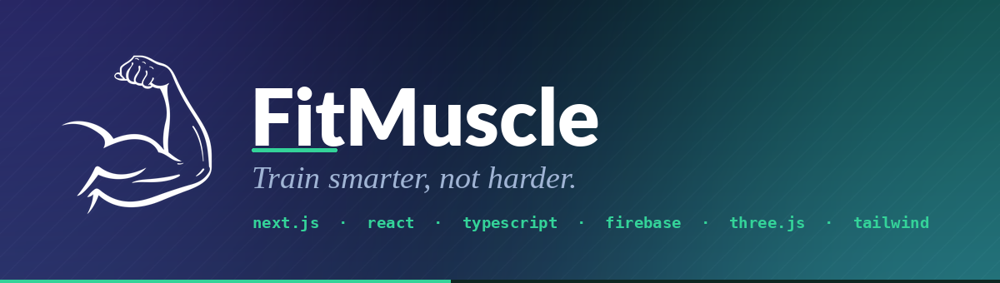

<h3>🏋️‍♂️ 𝐀𝐧 𝐚𝐧𝐚𝐭𝐨𝐦𝐲-𝐟𝐢𝐫𝐬𝐭 𝐭𝐫𝐚𝐢𝐧𝐢𝐧𝐠 𝐜𝐨𝐦𝐩𝐚𝐧𝐢𝐨𝐧</h3>

<p><em>Explore every muscle group in 2D, in a list, or on a real 3D model — then learn the exercises,<br>the anatomy, the injuries to avoid and the stretches that keep you training.</em></p>

<p>
  
  
  
  
  
  
</p>

<p>
  
  
  
  
</p>

<samp>

**[Features](#-features)** • **[Screenshots](#%EF%B8%8F-screenshots)** • **[Quick start](#-quick-start)** • **[Structure](#%EF%B8%8F-project-structure)** • **[Data](#-data--firebase)** • **[Roadmap](#%EF%B8%8F-roadmap)**

</samp>

</div>

---

## 💡 What is FitMuscle?

> **FitMuscle** *(a.k.a. Trainer App)* is a Next.js web app built for people who want to understand
> **what** they are training, **why** it matters and **how often** to hit it — not just count reps.
>
> Pick a muscle group, see it highlighted on a real anatomical illustration, then dive into
> exercises, function, common injuries, stretching routines and a recommended weekly frequency
> for your level. 💪

| | |
|---|---|
| 🧠 **Learn** | Anatomy, function and Latin names for 12 major muscle groups |
| 🏋️ **Train** | Curated exercises with sets, reps, equipment, difficulty and video links |
| 🩹 **Stay healthy** | Common injuries, prevention tips and stretching routines per muscle |
| 📅 **Plan** | A personal workout calendar with prioritised, checkable tasks |
| 🧊 **Explore** | An interactive 3D muscle model you can orbit, zoom and inspect |

---

## 🖼️ Screenshots

<div align="center">

<b><samp>M U S C L E &nbsp; C H A R T &nbsp; — &nbsp; G R I D &nbsp; V I E W</samp></b>

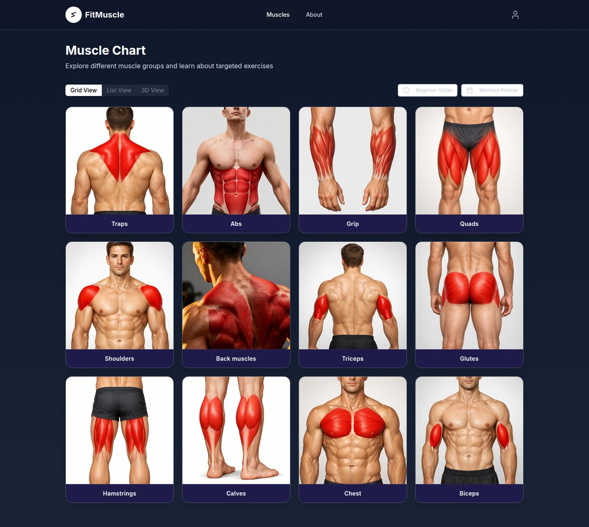

<br><br>

<table>
  <tr>
    <td width="50%" align="center">
      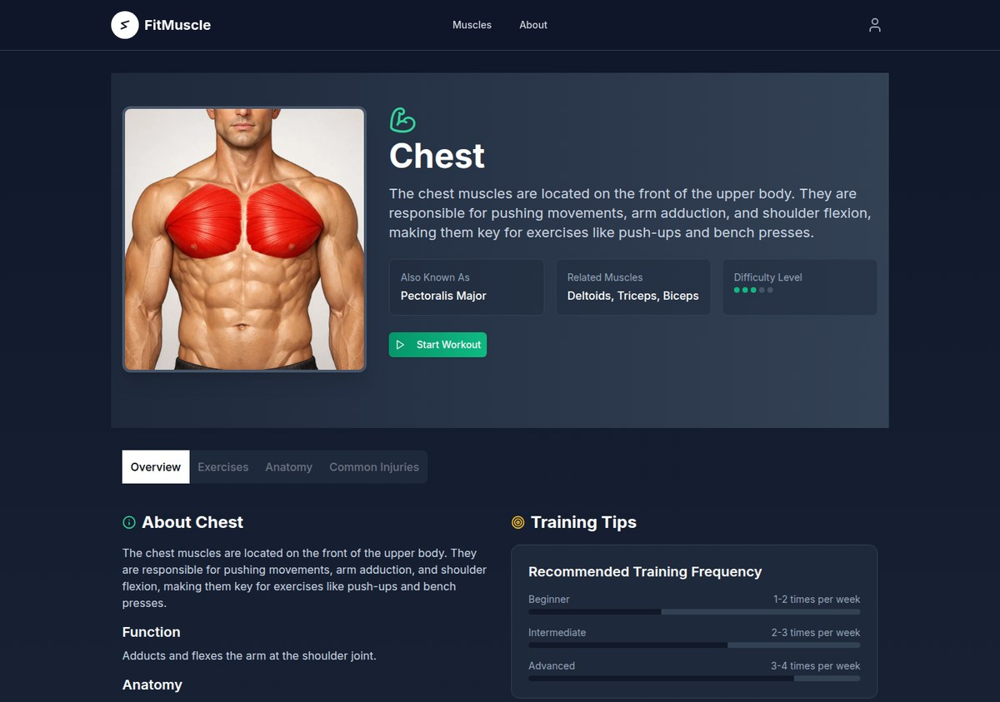<br>
      <sub><b>🔎 Muscle detail</b> — overview, training frequency & stretching</sub>
    </td>
    <td width="50%" align="center">
      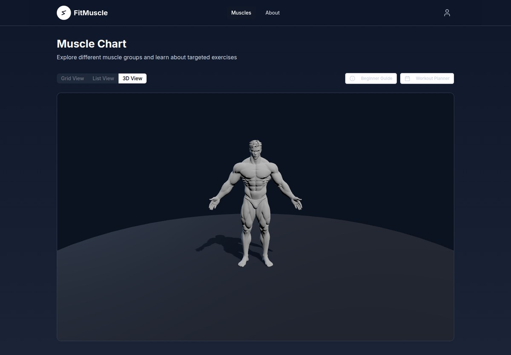<br>
      <sub><b>🧊 3D view</b> — an orbitable GLB model with studio lighting</sub>
    </td>
  </tr>
  <tr>
    <td width="50%" align="center">
      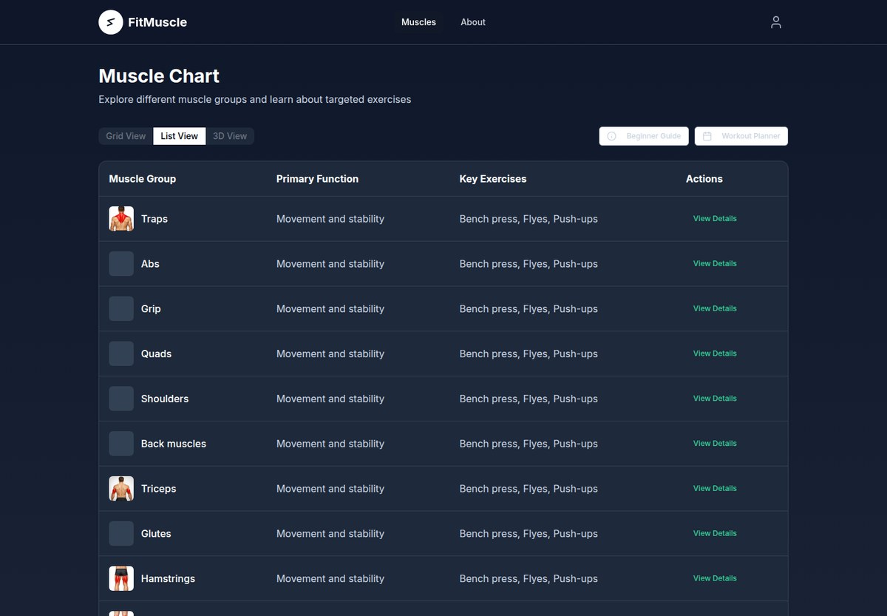<br>
      <sub><b>📋 List view</b> — compare muscle groups side by side</sub>
    </td>
    <td width="50%" align="center">
      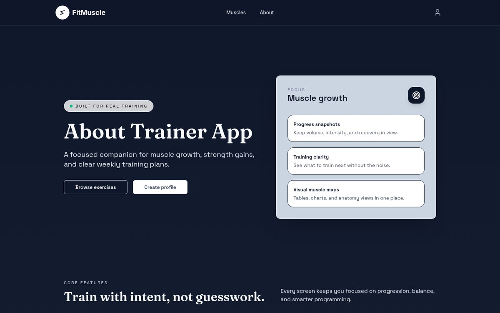<br>
      <sub><b>📖 About</b> — editorial layout with Fraunces & Space Grotesk</sub>
    </td>
  </tr>
</table>

</div>

---

## 💪 The muscle library

<div align="center">
<table>
  <tr>
    <td align="center" width="25%">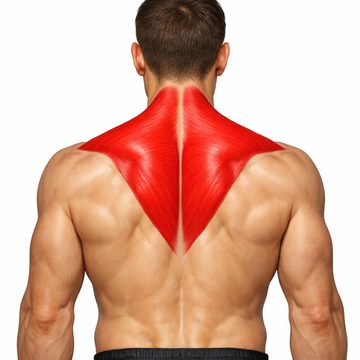<br><b>Traps</b><br><sub><i>Trapezius</i></sub></td>
    <td align="center" width="25%">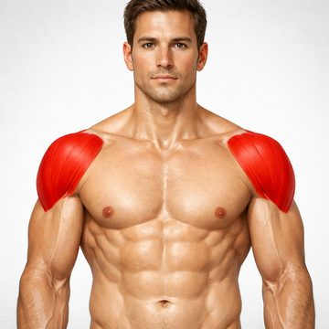<br><b>Shoulders</b><br><sub><i>Deltoideus</i></sub></td>
    <td align="center" width="25%">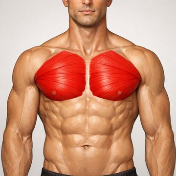<br><b>Chest</b><br><sub><i>Pectoralis major</i></sub></td>
    <td align="center" width="25%"><br><b>Back</b><br><sub><i>Latissimus dorsi</i></sub></td>
  </tr>
  <tr>
    <td align="center">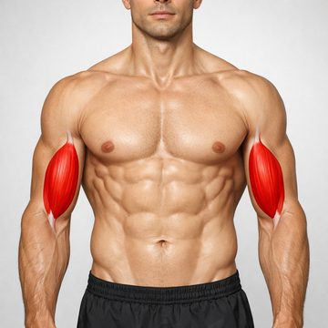<br><b>Biceps</b><br><sub><i>Biceps brachii</i></sub></td>
    <td align="center">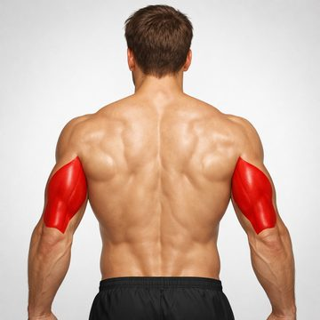<br><b>Triceps</b><br><sub><i>Triceps brachii</i></sub></td>
    <td align="center">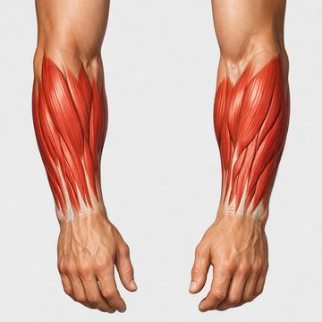<br><b>Grip</b><br><sub><i>Forearm flexors</i></sub></td>
    <td align="center">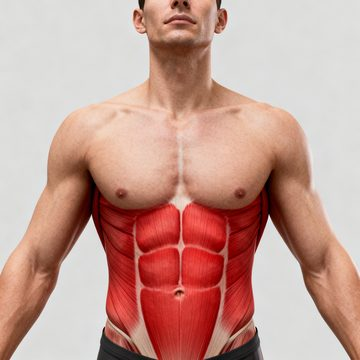<br><b>Abs</b><br><sub><i>Rectus abdominis</i></sub></td>
  </tr>
  <tr>
    <td align="center">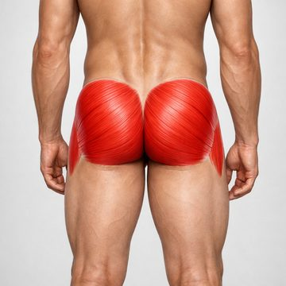<br><b>Glutes</b><br><sub><i>Gluteus maximus</i></sub></td>
    <td align="center">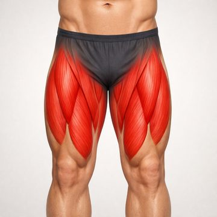<br><b>Quads</b><br><sub><i>Quadriceps femoris</i></sub></td>
    <td align="center">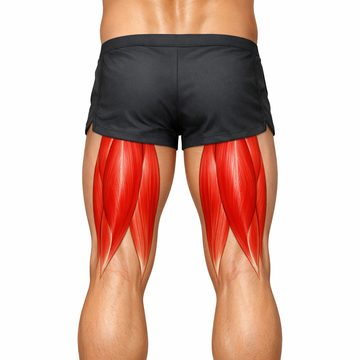<br><b>Hamstrings</b><br><sub><i>Biceps femoris</i></sub></td>
    <td align="center">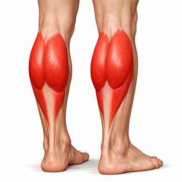<br><b>Calves</b><br><sub><i>Gastrocnemius</i></sub></td>
  </tr>
</table>
</div>

---

## ✨ Features

### 🎛️ Three ways to browse

| View | What you get |
|:--|:--|
| 🟦 **Grid** | Animated cards with the target muscle highlighted in red — hover for **View Details** |
| 📋 **List** | A dense table: muscle group, primary function, key exercises, quick actions |
| 🧊 **3D** | A `.glb` anatomical model rendered with **Three.js** — orbit, damping, soft shadows and a studio light rig |

### 🔎 Inside a muscle page

<table>
<tr>
<td width="50%">

**📖 Overview**
- Description & primary function
- Also known as *(Latin name)*
- Related muscle groups
- Difficulty level
- 📊 Recommended frequency for
  `beginner` / `intermediate` / `advanced`

</td>
<td width="50%">

**🏋️ Exercises · 🦴 Anatomy · 🩹 Injuries**
- Exercises with sets, reps, equipment,
  target, tips and video links
- Anatomy breakdown of the muscle
- Common injuries + prevention
- 🧘 Stretching routines with durations

</td>
</tr>
</table>

### 👤 Accounts & planning

- 🔐 **Email + password** sign-in and registration, validated with **Formik + Yup**
  <sub>(min 8 chars, one uppercase, one lowercase, one digit)</sub>
- 🟢 **Google sign-in** through a Firebase auth popup
- 🗄️ Profiles stored in **Cloud Firestore**, mirrored to `localStorage` so a refresh keeps you logged in
- 📅 **Workout calendar** at `/calendar/[profileId]` — tasks per day with `low` / `medium` / `high` priority and a done state

### ⚡ Performance & polish

- 🚀 **24 h `localStorage` cache** for muscles, exercises, injuries and stretches — Firestore is hit only when the cache is cold
- 🖼️ **Local image fallback** — if a muscle has no remote image, `muscleImageMapper` serves one from `/public/images/for_muscles_chart`
- 🌙 **Dark UI by default**, built with **Tailwind CSS** + **shadcn/ui** (Radix primitives)
- 🎞️ Motion-powered micro-interactions and a fully **responsive** layout
- 🧩 3D view is loaded with `next/dynamic` (`ssr: false`) so it never blocks first paint

---

## 🚀 Quick start

> **Requirements** — <kbd>Node.js ≥ 18</kbd> · <kbd>npm ≥ 9</kbd>

**1️⃣ Clone the repository**

```bash
git clone https://github.com/rodionspi/fit_muscle.git
```

**2️⃣ Install the dependencies**

```bash
cd fit_muscle && npm install
```

**3️⃣ Start the development server**

```bash
npm run dev
```

**4️⃣ Open the app** 👉 [http://localhost:3000](http://localhost:3000)

### 📜 Available scripts

| Command | What it does |
|:--|:--|
| <samp>`npm run dev`</samp> | Start the Next.js dev server on port `3000` |
| <samp>`npm run build`</samp> | Create an optimised production build |
| <samp>`npm run start`</samp> | Serve the production build |
| <samp>`npm run lint`</samp> | Run ESLint over the project |

---

## 🗂️ Project structure

```text
fit_muscle/
├── public/
│   ├── images/
│   │   ├── for_muscles_chart/     🖼️  12 anatomical muscle illustrations
│   │   └── logos/                 🏷️  app & provider logos
│   └── models/muscle_man.glb      🧊  the 3D anatomy model
├── src/
│   ├── app/                       🧭  Next.js App Router
│   │   ├── page.tsx               →   muscle chart (grid · list · 3D)
│   │   ├── about/                 →   /about
│   │   ├── muscles/[muscleId]/    →   muscle detail page
│   │   ├── profile/               →   login · registration · [profileId]
│   │   └── calendar/[profileId]/  →   workout calendar
│   ├── components/
│   │   ├── custom/                🧱  Header, Footer, Calendar, MusclesDisplay…
│   │   │   ├── Menubars/          →   main & user menubars
│   │   │   └── TabsContent/       →   Grid/List/3D + Overview/Anatomy/…
│   │   └── ui/                    🎨  shadcn/ui primitives (button, tabs, card…)
│   ├── contexts/                  🔄  UserContext · MusclesContext
│   ├── server/                    ☁️  Firestore & localStorage access layer
│   ├── lib/                       🧰  utils + muscleImageMapper
│   ├── types/                     📐  Muscle, User, Calendar, Navigation
│   └── firebaseConfig.ts          🔥  Firebase app, auth & Firestore setup
└── tailwind.config.cjs            💨  theme tokens & animations
```

---

## 🔥 Data & Firebase

The app talks to **Cloud Firestore** through a thin server layer in `src/server/`.

```text
📁 muscles/{muscleId}
   ├── 📄  n, sn, desc, anat, func, img, rel[], freq{ b, i, a }
   ├── 📁 exercises/          → img, n, diff, eq, tgt, desc, s, r, tips, vid
   ├── 📁 commonInjuries/     → n, desc, prev
   └── 📁 stretching/         → n, desc, dur
📁 users/{docId}
   └── 📄  id, name, email, calendar
```

The `Muscle` type uses short keys to keep documents small 👇

```ts
export interface Muscle {
  id: number;
  n: string;            // name
  sn: string;           // short / Latin name
  img: string;          // image URL
  desc: string;         // description
  anat: string;         // anatomy
  func: string;         // function
  rel: string[];        // related muscles
  ex: Exercise[];       // exercises
  inj: CommonInjury[];  // common injuries
  str: StretchingExercise[];
  freq: { b: string; i: string; a: string }; // beginner / intermediate / advanced
}
```

> ⚙️ **Configuration** — the Firebase web config lives in [`src/firebaseConfig.ts`](src/firebaseConfig.ts).
> Web API keys are *not* secrets, but your Firestore **security rules** are what actually protect the data —
> to run against your own project, swap the config object and enable **Email/Password** + **Google** providers in the Firebase console.

> 🧠 **Caching** — every read goes through a 24-hour `localStorage` cache
> (`muscles`, `muscle_exercises_<id>`, `muscle_injuries_<id>`, `muscle_stretching_<id>`).
> Clear your site data if you want to force a fresh fetch.

---

## 🛠️ Tech stack

| Layer | Tools |
|:--|:--|
| 🧱 **Framework** | Next.js 15 (App Router) · React 18 · TypeScript 5 |
| 🎨 **Styling** | Tailwind CSS 3.4 · shadcn/ui · Radix UI · Sass · `tailwindcss-animate` |
| 🧊 **3D** | Three.js · GLTFLoader · OrbitControls · React Three Fiber |
| 🔥 **Backend** | Firebase Auth (Email + Google) · Cloud Firestore |
| 📝 **Forms** | Formik · Yup |
| 🎞️ **Motion** | Motion / Framer Motion |
| 🧩 **Icons** | Lucide React · Heroicons |

### 🔤 Typography

The interface deliberately mixes three typefaces, all loaded via `next/font`:

| Font | Where | Sample |
|:--|:--|:--|
| **Inter** | Global UI text | <samp>Explore different muscle groups</samp> |
| **Fraunces** | Display headings on `/about` | *About Trainer App* |
| **Space Grotesk** | Body copy on `/about` | Train with intent, not guesswork. |

---

## 🗺️ Roadmap

- [x] 💪 Muscle chart with **grid**, **list** and **3D** views
- [x] 🔎 Muscle detail pages — overview, exercises, anatomy, injuries, stretching
- [x] 🔐 Email/password + Google authentication
- [x] 📅 Workout calendar with prioritised tasks
- [x] ⚡ 24-hour client-side caching layer
- [ ] 🏋️ Standalone **Exercise Library** page (`/exercises` — work in progress)
- [ ] 📈 Progress charts, personal records and volume tracking
- [ ] 🎯 Click a muscle **directly on the 3D model** to open its page
- [ ] 📚 Beginner guide, training tips, injury prevention & FAQ pages
- [ ] 🌍 Multi-language support

---

## 🤝 Contributing

Contributions are very welcome! 🎉

```bash
git checkout -b feature/amazing-feature
```

1. 🍴 Fork the repository
2. 🌿 Create your feature branch
3. ✅ Run <samp>`npm run lint`</samp> before committing
4. 📬 Open a pull request — or just [file an issue](https://github.com/rodionspi/fit_muscle/issues) with an idea

---

## 📄 License

Released under the **MIT License** — free to use, study, modify and share.

## 📬 Contact

<div align="center">

<a href="mailto:rodionspirik48@gmail.com"></a>
<a href="https://github.com/rodionspi"></a>

<br><br>

<samp>Made with 💚 and a lot of ☕ by <b>Rodion</b></samp>

<br>

<sub>⭐ If this project helped you train smarter, consider giving it a star!</sub>

</div>
